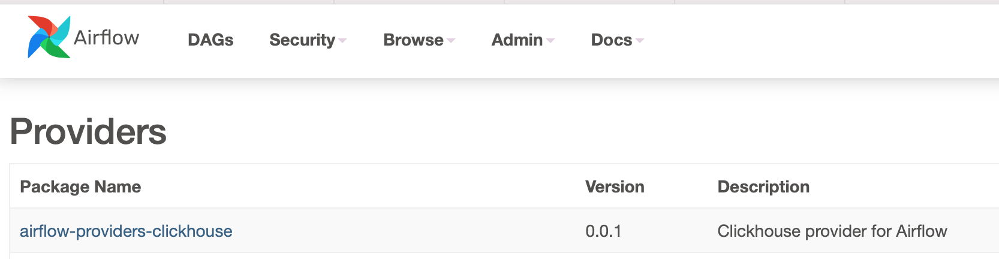
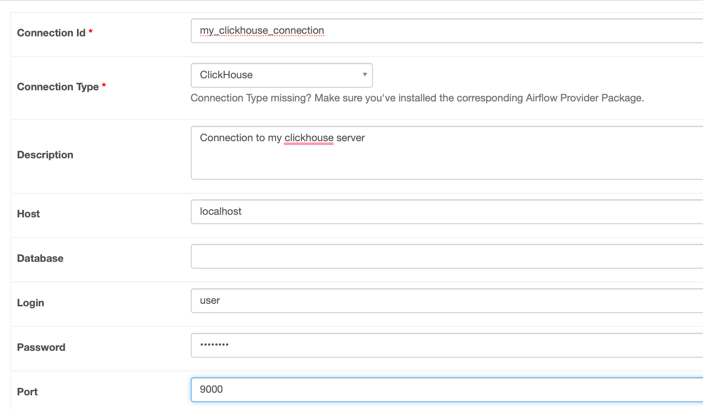

# apache-airflow-providers-clickhouse

Provider allow connection from Apache Airflow to Yandex Clickhouse Database and perform query using ClickhouseOperator.

## Installation

```shell
pip install airflow-providers-clickhouse
```

## Using

After installation, you can see provider in the Airflow providers list.


Now, you can add connection on the Airflow connection page.


## Example

```python
from datetime import datetime, timedelta

from airflow import DAG
from airflow.operators.dummy import DummyOperator

from apache.airflow.providers.clickhouse.operators.ClickhouseOperator import ClickhouseOperator

with DAG(
    dag_id='example_clickhouse_operator',
    start_date=datetime(2021, 1, 1),
    dagrun_timeout=timedelta(minutes=60),
    tags=['example','clickhouse'],
    catchup=False,
    template_searchpath='$AIRFLOW_HOME/include'
) as dag:

    run_this_last = DummyOperator(task_id='run_this_last')
    # load sql from file
    select_data = ClickhouseOperator(
        task_id='select_quit',
        sql='query.sql',
        click_conn_id='my_clickhouse_connection',
        do_xcom_push=False
    )
    # set sql direct in the code section
    select_push = ClickhouseOperator(
        task_id='select_xcom',
        sql='select * from TestTable;;',
        click_conn_id='my_clickhouse_connection'
    )

    select_data >> select_push >> run_this_last
```

## Get result of query

If property *do_xcom_push* equals _False_, no result pushed to XCom. Otherwise, result will be pushed to XCom.

## Additional

This code based on [clichouse driver](https://clickhouse-driver.readthedocs.io/en/latest/#). 